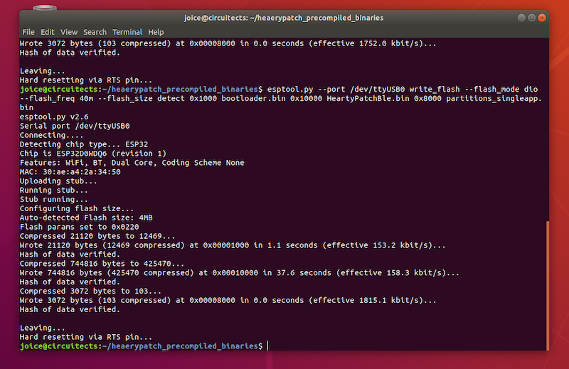
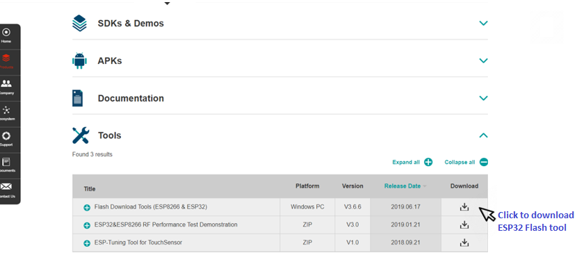
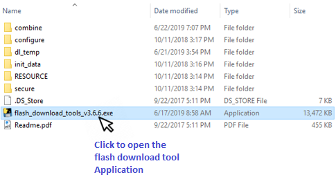

# Welcome to HeartyPatch


HeartyPatch is a completely open source, single-lead, ECG-HR wearable patch with HRV (Heart Rate Variability) analysis. It is based on the popular ESP32 system-on-a-chip.

If you don't already have one, you can buy one on our [Crowd Supply](https://www.crowdsupply.com/protocentral/heartypatch) campaign page. We have started shipping them out to backers.


# Getting Started with HeartyPatch

If you just want to use the HeartyPatch with the pre-loaded firmware, it comes ready to go. You do not have to do any programming to get it working. The pre-loaded firmware send HRV values over BLE.

<iframe src="https://player.vimeo.com/video/249182147" width="640" height="360" frameborder="0" webkitallowfullscreen mozallowfullscreen allowfullscreen></iframe>

## The HeartyPatch App for Android - BETA

An android app for HeartyPatch is now available that receives and displays the real-time heart rate as well as HRV trends and variables. The app scans for any HeartyPatch devices in the vicinity and shows a list of devices accessible through Bluetooth Low Energy (BLE). Please note that you would need an Android device with BLE support to use this app.

You can download and install the app from the [Google Play Store](https://play.google.com/store/apps/details?id=com.protocentral.heartypatch) in the following link:

[](https://play.google.com/store/apps/details?id=com.protocentral.heartypatch)

*Note: The android app for HeartyPatch is still in BETA and there might be some instability as a result.*

*Note: HeartyPatch can also be used with any Android app that supports the heart-rate profile.*

# Modes of operation

HeartyPatch at any time can work in only ONE of the following modes. Wi-Fi and BLE do not work together as of now.

## Bluetooth LE Mode
With the preloaded firmware, the HeartyPatch will do heart-rate and R-R interval measurement and send it over BLE through a standard [Heart-rate BLE service](https://www.bluetooth.com/specifications/gatt/viewer?attributeXmlFile=org.bluetooth.service.heart_rate.xml), as well as a separate custom HRV service that will provide parameters used for HRV analysis such as SD, Mean RR, PNN50 and SDNN.


## Continuous ECG Streaming mode over WiFi/TCP

The HeartyPatch can also do live ECG streaming from the chest. This works similar to a heart-rate monitor. Below is a screen capture of the device working in ECG mode. The data is sent over a TCP socket over WiFi. To get the WiFi mode turned on, you will have to [flash a different firmware onto the device](#continuous-ecg-streaming-mode-over-wifitcp).


# Updating the firmware

It is important to always keep your firmware up-to-date for best results. We keep adding changes, bug fixes and enhancements as and when we do updates. HeartyPatch will continue to be developed and new features added.

Be on the lookout for new firmware releases on our Github releases page at https://github.com/Protocentral/protocentral_heartypatch

Download the latest binary files from the [HeartyPatch Github releases page](https://github.com/Protocentral/protocentral_heartypatch/releases/latest). Binary file names end with xx_bin.zip.

Unzip the files into a folder. Now, plug in your HeartyPatch to your computer through any USB port and follow the following procedures according to your computer's operating system.

## Updating the firmware on MacOS/linux

[esptool](https://github.com/espressif/esptool) is a Python-based utlity program to download binary files onto ESP32 chips. Please follow the following steps to install esptool.

Before starting, you will need to make sure you have Python 2/3 installed on your computer.

Open the termimal on your MacOS/Linux computer and run the command given below to download latest stable esptool.py release.
```c
pip install esptool
```
Now you should be able to run *esptool.py* from the command line. If installation fails, please refer to the [esptool page](https://github.com/espressif/esptool) for possible solutions.

Download the latest binary files from the [HeartyPatch Github releases page](https://github.com/Protocentral/protocentral_heartypatch/releases/latest). Binary file names end with xx_bin.zip.

Unzip the files into a folder.

Now, plug in your HeartyPatch to your computer through any USB port and run the following command from the same folder in which you have unzipped the files.

```c
esptool.py --port <your-port-name> write_flash --flash_mode dio --flash_freq 40m --flash_size detect 0x1000 bootloader.bin 0x10000 HeartyPatchBle.bin 0x8000 partitions_singleapp.bin
```

Make sure to replace *<your-port-name>* with the name of the port to which your HeartyPatch. If you get a permission denied error, please run this in "sudo" mode.

If all goes well, you should see the following output on the terminal.



Congratulations ! You have now successfully uploaded the firmware to your HeartyPatch.

## Updating the firmware on Windows

The ESP32 Flash Download Tool is the official Espressif Download tool that runs on Windows platform. The tool can be used to modify and generate init BINs, generate consolidated BIN files or program multiple chips for production runs.

### Installing ESP32 Flash Download Tool

* Download the ESP32 tool from [Espressif's website in tools section](https://www.espressif.com/en/products/hardware/esp32/resources) as shown below



* Once downloaded, open the flash_download_tools_v3.6.6.exe application from the downloaded folder as shown below



* When the program opens, select *ESP32 Download tool* from the buttons.


* In the resulting window that opens, make sure to select the following options


1.	SPI download tab. In general, you should use SPI download mode.

2.	Add the bin files downloaded earlier to the ESP32 download tool interface one by one as listed below.

  |S.no| HeartyPatch Bin Files   |Address      |
  |----------------- |:--------------------:|-----------------:|
  | 1              | Bootloader.bin                  |  0x1000  |             
  | 2       | HeartyPatchBle.bin                   |  0x10000           |
  | 3            | Partitions_singleapp.bin                   |  0x8000     |

3.	Click on the check boxes to select the bin files.
4.	Crystal Frequency for heartypatch should be set as 40M.
5.	SPI Flash speed for heartypatch should be set as 26.7MHz.
6.	SPI Mode for heartypatch should be set as DIO mode.
7.	Flash memory size for heartypatch should be set as 32Mbit.
8.	Select the port number of your heartypatch device and set baud rate to 115200.
9.	Current status: Tells about the current operation status. Whether the download tool is idle or running, etc.
10. Click Start button to start programming.
11.	Progress bar indicates firmware uploads program. Once bin files is uploaded the indication status displays finish.
12.	Program displays PHY MAC IDs for Wi-Fi, BLE, ethernet, etc.

Congratulations ! You have now successfully uploaded the firmware to your HeartyPatch.

# Compiling your own firmware (advanced, optional)

The firmware for the HeartyPatch's on-board Espressif ESP32 chip uses the [esp-idf framework](https://github.com/espressif/esp-idf)
 for development. You will need to install and configure the following components to setup a development environment:

* **The Xtensa ESP32 toolchain**
  Please make sure to download the toolchain from the [Espressif Setup Guide for v2.1](http://esp-idf.readthedocs.io/en/v2.1/get-started/index.html#standard-setup-of-toolchain)

  This version of the esp-idf compiles well only with the toolchain version 1.22.0-61-gab8375a-5.2.0.

* **The v2.1 release of esp-idf**
  *The current version of the HeartyPatch code compiles well and performs well only with v2.1 of the ESP-IDF and version 1.22.0-61-gab8375a-5.2.0 of the Xtensa toolchain.*

  [Download the ESP-IDF version 2.1 here](https://github.com/espressif/esp-idf/releases/download/v2.1/esp-idf-v2.1.zip)

  Setup guides for these components are available on the [ESP-IDF documentation site](https://esp-idf.readthedocs.io/en/v2.1/get-started/index.html).

* Clone our [Github repository](https://github.com/Protocentral/protocentral_heartypatch) of code for the ESP32:

  `git clone https://github.com/Protocentral/protocentral_heartypatch.git`

  [or download a zip file of the latest master branch](https://github.com/Protocentral/protocentral_heartypatch/archive/master.zip).

* Download this zip file, rename it to whatever you want to. Change to this directory and then start building.

`Please make sure that correct version of all of the above tools are installed before proceeding.`

The folder "heartypatch-ble" in the "Firmware" contains the code for the preloaded firmware on the HeartyPatch, which calculates R-R interval, heart rate and time domain parameters for HRV analysis and sends them through BLE.

Now that you have the code and ready to build, you will need to configure the build options for heartypatch through menuconfig utility:

* Open the terminal and navigate to the folder which contains the heartypatch code 	
* Start the project configuration utility **menuconfig**     		
  `make menuconfig`

  

* Configure your serial port under *Serial flasher config -> Default serial port*

  

* Use the *Heartypatch configuration* to enable BLE mode

  

BLE mode at this time does not support ECG stream since the MAX30003 sensor is configured for R-R detection only. By enabling the wifi, you may get hr and rr values through TCP in the Heartypatch GUI. For ECG stream you may use the heartypatch-stream-tcp code [protocentral-heartypatch/firmware/heatypatch-stream-tcp]

* Navigate to component config -> esp32-specific ->main XTAL frequency and select 26 Mhz as the board crystal

  

* Save the configuration by selecting `<save>` and close menuconfig

* Run the makefile (assuming previous steps are done correctly):

  `make` or `make -j5`

* To flash the firmware on to the board, just use:

  `make flash`

  If the flashing is successful, you should see something similar to the below screen:

  

# Continuous ECG mode

The folder `heartypatch-stream-tcp` contains the code for streaming ECG.

Before flashing this code, enable wifi, TCP and mdns through `makemenuconfig` similar to the process described in the previous section.

* Start makemenuconfig and navigate to *Heartypatch configuration*, set your wifi ssid and password, enable mdns and TCP:
  

* Configure the serial port under Serial flasher config -> Default serial port
* Navigate to *Component config -> esp32-specific ->main XTAL frequency* and select 26 MHz as the board crystal

Run the makefile (assuming previous steps are done correctly):

`make` or `make -j5`

To flash the firmware on to the board, just use:

`make flash`

If the flashing is successful, you should see something similar to the below screen:


You can open the IDF monitor to see the debug messages by using the command:

`make monitor`


Once the heartypatch is connected with the wifi, open the gui from the project folder and you should be able see the ECG stream.  

More information about this process and the ESP32 framework is available in the [ESP32 Get Started Guide](http://esp-idf.readthedocs.io/en/latest/get-started/).

# The TCP Client GUI

The HeartyPatch is now configured as a TCP sever ready for connection from a TCP client. The HeartyPatch sends data out in the following packet format.

| Offset| Byte Value  | Description|
------  | ----------- | -----------
| 0     | 0x0A | Start of frame
| 1     | 0xFA | Start of frame
| 2     | Payload Size LSB |
| 3     | Payload Size MSB |
| 4     | Protocol version | (currently 0x03)
|5-8    | Packet sequence | incremental number
|9-16   | Timestamp | From ESP32 gettimeofday()
|17-20  | R-R Interval |
|18-... | ECG Data samples | Currently 8 samples / packet|
|...    | 0x0B | End of Frame|


You can download the ProtoCentral TCP client GUI for your platform from the following link.

[Download TCP Client GUI](https://github.com/Protocentral/protocentral_heartypatch/releases/latest)

After you unzip and run the executable program on your computer, choose the default address (heartypatch.local) and click connect. You should see a screen like this:


# Frequently Asked Questions

* **Why is the heart-rate not stable? There's always variation.**

  Do not worry, that's what is [Heart-rate variability](https://en.wikipedia.org/wiki/Heart_rate_variability) and HeartyPatch displays real-time beat-to-beat heart rate. Heart-rate is supposed to vary from beat-to-beat.

* **How do I get the full ECG signal from the device?**

  Please read our [Guide to program the device the TCP Streaming mode](#continuous-ecg-mode)

* **I have problems getting the code to compile. What do I do?**

  Most of the problems in compilation arise from having the wrong versions of the ESP-IDF. Please make sure the versions of the esp-idf as well as the Xtensa toochain match the ones given in out [Guide to firmware upgrades](#updating-the-firmware)

* **Help, there is not LED flashing on the device.**

  By default, the LED would not flash. This is done to conserve battery power. This can be enabled in the software though.

* **Why is the ECG  signal too noisy?**

  Noise is very common in ECG systems and they usually use filters to take them out. The HeartyPatch already has hardware as well as software filters to remove noise. However, there are still some conditions which can cause the signal to be noisy:

    * Contact is key. Make sure that the electrode pad is fully flat on the body and it is positioned properly.
    * Make sure that the position of the HeartyPatch is correct (refer to the video). Other positions may not provide a strong signal
    * Do not use the HeartyPatch on the body while it is connected to the USB cable. Always remove the cable before wearing the HeartyPatch.
    * A common source of noise is dry skin. Dry skin does not give good electrical conductivity.
    * Do not re-use ECG electrodes. The quality of contact would reduce with each use.

*We will continue to add to this list based on user input, so please check this list if something goes wrong.*

# License Information

This product is open source! Both, our hardware and software are open source and licensed under the following licenses:

## Hardware

All hardware is released under [Creative Commons Share-alike 4.0 International](http://creativecommons.org/licenses/by-sa/4.0/).


## Software

All software is released under the MIT License(http://opensource.org/licenses/MIT).

Please check [*LICENSE.md*](LICENSE.md) for detailed license descriptions.

THE SOFTWARE IS PROVIDED "AS IS", WITHOUT WARRANTY OF ANY KIND, EXPRESS OR IMPLIED, INCLUDING BUT NOT LIMITED TO THE WARRANTIES OF MERCHANTABILITY, FITNESS FOR A PARTICULAR PURPOSE AND NON-INFRINGEMENT. IN NO EVENT SHALL THE AUTHORS OR COPYRIGHT HOLDERS BE LIABLE FOR ANY CLAIM, DAMAGES OR OTHER LIABILITY, WHETHER IN AN ACTION OF CONTRACT, TORT OR OTHERWISE, ARISING FROM, OUT OF OR IN CONNECTION WITH THE SOFTWARE OR THE USE OR OTHER DEALINGS IN THE SOFTWARE.
